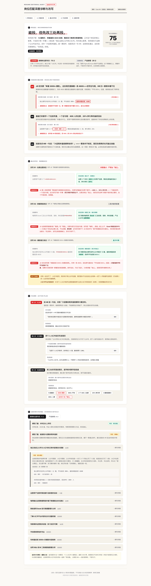
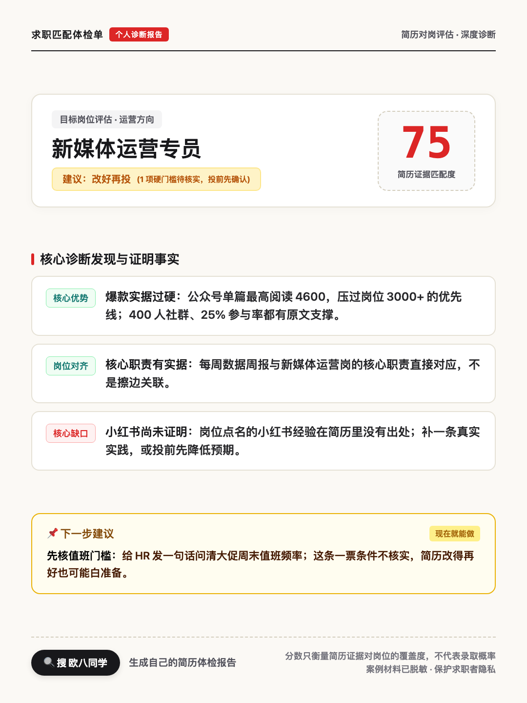
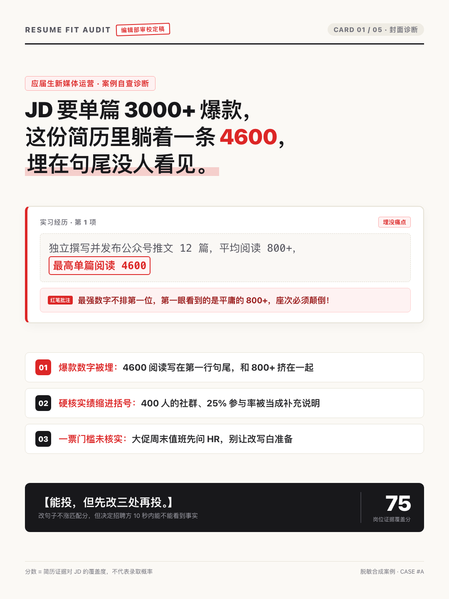
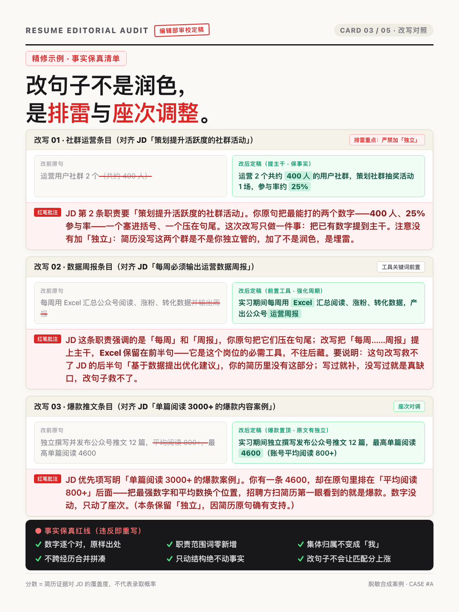

# 简历优化大师（jd-resume-match）

投简历之前，先做一次「简历 vs JD」的证据体检：分数可复算、每条判定都引用简历原文、改写不编造事实。

Python 3.9+（仅标准库，零依赖）· 215 项自动化测试 · MIT

## 它解决什么问题

改简历最怕两件事：看不出 JD 到底在筛什么，也说不清自己哪里够不上。

你把简历和一个或多个 JD 交给 AI 智能体（Claude Code / ZCode / Codex CLI 等支持 SKILL.md 的宿主），它会：

- 把每份 JD 拆成逐条要求，标出「必须 / 一般 / 加分」和一票条件（学历、年限、值班接受度这类硬门槛）；
- 在你的简历原文里逐条定位证据，给出 supported / partial / unclear / unmet / unknown 五态判定，每条都附原文引用和位置；
- 算出可复算的匹配分（0–100）与投递建议（优先投 / 改完再投 / 暂缓）——**unmet 硬门槛强制「暂缓」，高分抵消不了**；材料里没写的信息记 `unknown`，绝不推断成「不满足」；
- 给出 3–5 处不改事实的重点改写（逐字前后对照，每个数字有出处，不新增「独立负责」这类原句没有的职责词）和 3 项行动清单。

**分数只衡量「简历证据对 JD 要求的覆盖」，不是能力总分、ATS 官方分，也不是面试概率。**算分的不是模型：权重、系数、建议规则全部写在公开量尺 [`references/scoring-rubric.md`](references/scoring-rubric.md) 里，由确定性脚本复算，同一输入必得同一分数。

## 成品长什么样

编辑批注风的 HTML 体检单（自包含单文件，`file://` 直接打开，不联网）：

<p align="center">
  
</p>
<p align="center"><sub>报告整页缩略（合成案例 A）· 阅读顺序：投递判断与分数 → 优势和关键差距 → 局部修改对照 → 待补事实及行动 → 原文依据</sub></p>

交付物还有两套 1080×1440 分享卡与发布文案（以下均为合成案例、已脱敏）：

<table>
  <tr>
    <td align="center"><br><sub>成员版分享卡（默认 1 张，给求职者本人）</sub></td>
    <td align="center"><br><sub>案例版卡片 · 封面</sub></td>
    <td align="center"><br><sub>案例版卡片 · 改写对照</sub></td>
  </tr>
</table>

案例版卡片（1–6 张）与配套小红书文案面向做求职内容分享的创作者，文案里每条标题都有报告证据对应。

## 怎么工作

六步，模型与脚本各管一段，分数永远出自脚本：

1. **提交材料**：一份简历（PDF / DOCX / TXT / MD）+ 一个或多个 JD（文本、文件或链接）。
2. **脚本提取**：解析文件并给识别摘要；空文件、加密、扫描件、乱码 PDF 走显式降级路径，说清楚缺什么、怎么补，不硬装能分析。
3. **模型初诊**：拆 JD 要求、逐条在简历原文定位证据，产出结构化报告 JSON（此步不算分）；最多 3 个澄清问题，可整体跳过，你的回答只作为补充证据登记。
4. **脚本算分**：`score_report.py` 按量尺复算分数 / 建议 / 排名并回写；结构、引用、隐私校验任何一项不过，直接拒绝出报告。
5. **渲染交付**：自包含 HTML 体检单 + 成员版分享卡 PNG + 案例版卡片与发布文案。
6. **三句话结论**：怎么投、最值钱也最委屈的发现（带数字）、现在就能做的第一步。

## 安装

需要 Python 3.9+（仅标准库，无需 `pip install`）和一个支持 `SKILL.md` 的智能体宿主；导出 PNG 需要本机装有 Chrome / Chromium / Edge（不装也能拿到全部 HTML / MD 成品）。

```bash
# ZCode 等宿主
git clone https://github.com/ouxxyy/jd-resume-match.git ~/.zcode/skills/jd-resume-match

# Claude Code
git clone https://github.com/ouxxyy/jd-resume-match.git ~/.claude/skills/jd-resume-match
```

仓库根目录就是 skill 本体，clone 即可用。想装得干净（不带 tests / docs），在仓库根运行 `./install.sh <你的 skills 目录>`；或从 [Releases](../../releases) 下载 zip（附 sha256 校验值）。全部安装路径见 [INSTALL.md](INSTALL.md)。

## 第一次使用

对智能体说：

> 用 jd-resume-match 分析我的简历 + 这个 JD

把简历文件和 JD（文本 / 文件 / 链接）发给它即可。想先看效果，直接用自带的合成案例：

> 用 jd-resume-match 体检 examples/case-a-freshgrad-ops/ 里的合成简历

不依赖智能体也能验证脚本体（装完的冒烟检查）：

```bash
python3 ~/.zcode/skills/jd-resume-match/scripts/validate_report.py \
  --input ~/.zcode/skills/jd-resume-match/examples/case-b-2yr-data-dev/expected.json
# 期望输出包含 PASS（结构 + 引用 + 隐私校验通过）
```

## 校验与开发

```bash
# 全量测试（契约校验、评分规则、提取降级、渲染/分享、编排纪律、脱敏隔离）
python3 -m unittest discover -s tests -v

# 复算黄金案例的分数并与期望值核对 / 逐项推导
python3 scripts/reference_score.py --check examples/case-a-freshgrad-ops/expected.json
python3 scripts/reference_score.py --show  examples/case-a-freshgrad-ops/expected.json

# 重新生成发布素材（确定性渲染，同输入同输出）
python3 scripts/render_editorial.py --input examples/<案例>/expected.json \
  --editorial examples/<案例>/editorial.json --outdir dist/publish/<案例>
```

评分口径（权重 / 系数 / 建议规则）只住在 `references/scoring-rubric.md`；改它必须升版本号并同步更新全部黄金案例期望值，同一提交内完成——测试会守住这条线。

## 隐私

- 真实材料只在本地会话中处理；本 skill 不询问、不存储任何 API 密钥。「离线」指报告浏览不需联网，分析过程由宿主智能体及其配置的模型完成。
- 分享卡与发布文案只消费脱敏白名单字段，生成前过 `private_markers` / 邮箱 / 手机号扫描；真实案例须先在数据源完成公司、学校等泛化并登记 `redactions` 白名单。**完整报告含材料细节，发布前自己预览，不要外发。**
- 仓库内 `examples/` 全部是合成材料（`synthetic: true`），无一真实简历或 JD。

## 限制（诚实清单）

- **中文 PDF 大概率乱码**：CID / Type0 字体不做解码（零依赖的边界），会明确告警并请你改贴文本或用 DOCX / TXT；「乱码必有告警」由双防线保证，但告警不等于能读。不做 OCR，扫描件直接拒绝评分，绝不拿 0 字节硬算分。
- JD 链接抓取尽力而为（10 秒超时、2MB 上限）；需登录或反爬的页面会失败，引导你粘贴全文。
- 初诊、澄清与证据引用的质量依赖宿主智能体；提取、校验、评分、渲染是确定性脚本，同输入必出同输出。
- 分数基于 4 个合成案例、7 个岗位视角校准（rubric 0.1.0），衡量证据覆盖度，不预测任何录取概率，也不宣称「XX% 置信度」。

## 作者

作者全平台同名：**欧八同学**。

- 个人主页 / 联系我：[albertou.redboook.cn](https://albertou.redboook.cn/)
- 微信公众号：扫码关注
- 抖音：[搜索“欧八同学”](https://www.douyin.com/search/%E6%AC%A7%E5%85%AB%E5%90%8C%E5%AD%A6)
- 小红书：[搜索“欧八同学”](https://www.xiaohongshu.com/search_result?keyword=%E6%AC%A7%E5%85%AB%E5%90%8C%E5%AD%A6)
- X：[搜索“欧八同学”](https://x.com/search?q=%E6%AC%A7%E5%85%AB%E5%90%8C%E5%AD%A6&src=typed_query)

<p align="center">
  
</p>

如果这个项目对你有用，欢迎点个 Star。遇到问题时，提交命令、报错和最小复现步骤就够了；请不要上传真实私人照片。

## 许可证

[MIT](LICENSE)。本项目未复制任何上游仓库代码；研究过的仓库与许可证边界见 [THIRD_PARTY_NOTICES.md](THIRD_PARTY_NOTICES.md) 和 [docs/reference-audit.md](docs/reference-audit.md)。
